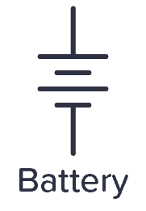
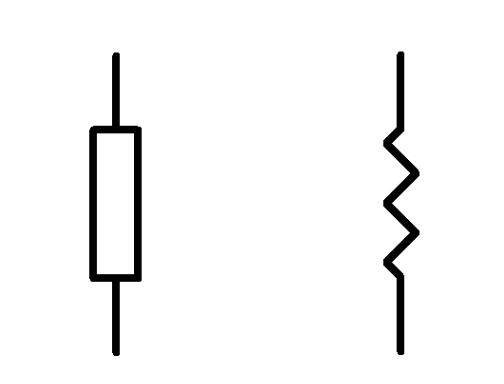

# Creative Technology for Community Education
#### Casey Anderson, 2023

##### Session 2

---

<!-- paginate: true -->

## Session 2

- **Lecture** Introduction to Electronics *Slides 3 - 8*
- **Workshop** Prototyping on a Breadboard; LEDs; Light switch; Button Terminology, Momentary vs. Toggle *Slides 9 - 18*
- **Demo** DIY Buttons *Slide 19*
- **Group Workshop** Prep for homework assignment *Slide 20*
- **Assignments** *Slide 21*
  - Read “Haiti Photography Project,” Chin
  - 10x DIY Button Prototype Sketches
  - Prototype 2x DIY Buttons (1 momentary, 1 toggle)

---

## Introduction to Electronics

**Electricity** is the flow of **electrons**.

Working with electricity requires an understanding of the behavior of electrons. We can measure this behavior in order to decide how to accomplish certain goals.

For our purposes we will limit our electronics discussion to the following characteristics: **resistance**, **current**, and **voltage**.

---

### Voltage

**Voltage** is the **potential difference** in quantity of electrons between two points in a circuit. This difference results in an **electromotive force**.

The higher the voltage (measured in **volts**), the more **force** an electron experiences.

---

### Resistance

**Resistance** (measured in **Ohms**) is the measure of the opposition to electron flow in a circuit.

Frequently we need to limit current flow, for example: a resistor is used with an **LED** in order to avoid breaking the LED.

---

### Current

Electrical current is the rate of **electron flow**. When a **voltage** is applied across a **resistance** electrons will flow through a conductor (i.e. wire) at a specific speed. In other words, current describes the speed of electron travel.

We measure current in **amps** (the full term is **amperes**, actually, but I have literally never heard a single person say anything other than **amps** and I have an electronics textbook that explicitly says not to say "amperes").

---

### Ohm's Law

The relationship between **voltage**, **current**, and **resistance** is described by **Ohm's Law**: "the current through a conductor between two poins is directly proopotional to the voltage across those points" ([wikipedia](https://en.wikipedia.org/wiki/Ohm%27s_law)).

---

### Ground

Ground is an electrical reference point from which voltages are measured. Ground is kind of like the electrical equivalent of sea level when describing about elevation.

---

## Prototyping on a Breadboard

A breadboard allows one to prototype circuits without a soldering iron. It has a pattern of pre-established connections that are illustrated in the diagram to the left (from [here](https://ctools.ece.utah.edu/_Outreach/_Outreach.htm))

---

### Breadboard layout

On the left and right sides, running vertically, are **two power rails**. All points on the blue rail are connected, all points on the red rail are also connected. The red and blue rails are **not** connected to each other. Typically we run **Power (V+)** to red and **GND (V-)** to blue.

---

### Breadboard layout

The inside of the breadboard is divided into two sides, separated by a space. Each point in row 1 is labeled via letters A - E. Points 1A - 1E are connected. On the other side of the space row 1 continues: Points 1F - 1J are connected. Points 1A - 1E and 1F - 1J are not connected.

---

### LEDs

Diodes are components that allow unidirectional current flow. A common type of diode is a Light Emitting Diode (LED).

LED polarity is indicated by the length of its legs: the long leg (**anode**) is positive, the short leg (**cathode**) is negative.

---

### LED Circuit

---

## LED Switch Circuit

---

### 2x LED Circuit

---

### 2x LED Switch Circuit

---

### Button Terminology

- **State**: on (connected, electrons can flow) or off (disconnected, electrons cannot flow)
- **Acutation**: the physical action necessary to change the state of a switch / button i.e. push, slide, flip, rotate
  - **Momentary**: remain connected when **actuated** i.e. the push buttons are connected as long as we continue pushing them. When we release they return to their **normal position** (**NO** or **NC**)
  - **Toggle**: stay in one state until actuated to a different state i.e. a light switch

---

### Button Terminology

- **Pole**: the number of circuits one switch can control simultaneously. We will use/make **single pole** switches
- **Throws**: the number of positions a switch can be thrown to. We will use/make **single throw** switches

Typically we refer to buttons by describing their method of actuation as well as quantity of poles and throws. For example: a **Single Pole Single Throw Push-button**

---

## DIY Buttons

**DIY Buttons** are buttons / switches made using only conductive tape and cardboard / paper. Though technologically simple they can easily be disguised or embedded in order to produce different meanings / feelings when participants interact with them. 

Demo: some examples of "DIY Buttons" will be presented.

---

## Prep for homework assignment

In groups of 2:
- Confirm that you can wire up an LED Switch circuit that works on a breadboard. Experiment by wiring it up three different ways: in different positions, by switching the order of components, etc.
- Remove the manufactured button from your breadboard and turn the LED on and off with only wires

---

## Assignments
- Read [Haiti Photography Project](https://elizabethjchin.com/portfolio/haiti-photography-project/), Chin
- Sketch 10x DIY Button Prototype Sketches. 5 must be toggle, 5 must be momentary
- Choose 1 toggle and 1 momentary DIY Button prototype from your sketches and make it (plan to make to make at least two versions of each: one to confirm functionality and one to look nice). You should be able to wire it up on your breadboard and turn an LED on and off by interacting with each
- Be prepared to present DIY Button prototypes / sketches for feedback in next week's sesssion
